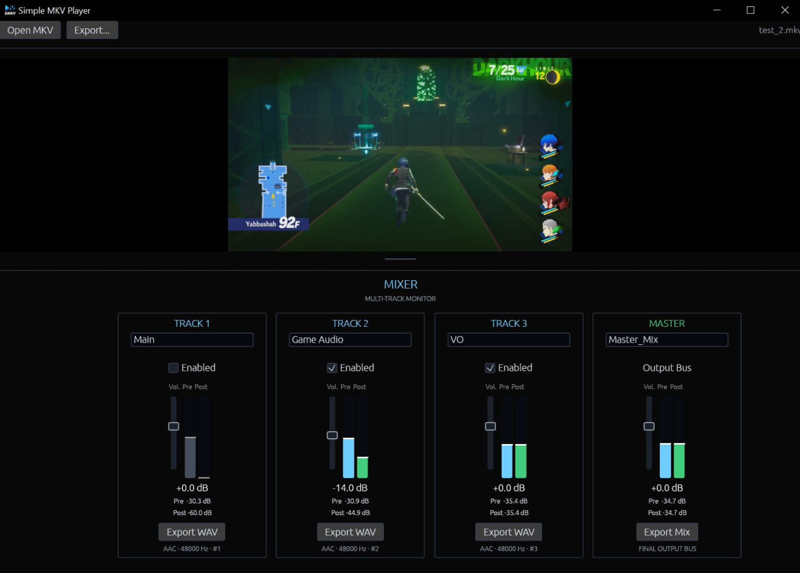

<p align="center">
  
</p>

<h1 align="center">Simple MKV Player</h1>

<p align="center">
  <i>A lightweight Windows video player and audio exporter for multi-track recordings.</i>
</p>

Simple MKV Player is a lightweight Windows video player and audio exporter built for videos that contain multiple embedded audio tracks, especially OBS recordings.

Most video players make you choose one audio track at a time. Simple MKV Player lets you play the video while monitoring and mixing multiple tracks simultaneously, while also letting you immediately isolate and export individual audio streams for further editing elsewhere.

A typical OBS recording might contain:

- Track 1 - full stream mix
- Track 2 - game audio
- Track 3 - microphone

With Simple MKV Player, you can mute the full mix, enable the game and mic tracks, adjust them independently, and hear the result immediately without modifying the original recording.

<p align="center">
  
</p>

## Features

- Embedded MKV/video playback
- Simultaneous playback of multiple audio tracks
- Export individual audio tracks or multiple tracks as separate WAV files
- Export your current master mix to WAV
- Re-export the original video with your current audio mix to a new MKV
- Video is copied during mixed-video export rather than re-encoded
- Independent enable/mute control for each track
- Independent per-track gain controls
- PRE and POST level meters for each track
- Master mix gain and metering
- Editable track and master mix names
- Fullscreen playback
- Seek/scrub controls

The source recording is never modified.

## Controls

- **Space** — Play / pause
- **Click the video** — Play / pause
- **F** — Toggle fullscreen
- **Double-click the video** — Toggle fullscreen
- **Esc** — Exit fullscreen
- **Drag the video divider** — Resize the video area
- **Double-click the divider** — Reset the video size

## Getting Started

### Installer

The recommended version for most users is:

```text
Simple_MKV_Player_vX.Y.Z_Setup.exe
```

Run the installer and launch **Simple MKV Player** from the Start Menu or desktop
shortcut.

### Portable

For the portable version:

1. Extract the entire ZIP.
2. Keep the extracted files together.
3. Run:

```text
Simple MKV Player.exe
```

A dedicated windows shortcut will allow use of the player with no installation needed

## Exporting

Use **Export...** to create:

- WAV files for individual tracks
- Separate WAV files for multiple selected tracks
- A WAV of the current master mix
- A new MKV containing the original video and the current audio mix

Track and master gain settings are applied to mixed exports.

## Platform

Simple MKV Player is currently built for 64-bit Windows.

## License

Simple MKV Player is released under the MIT License.

Binary releases also include FFmpeg/ffprobe and libmpv under their own licenses.
See:

```text
THIRD_PARTY_NOTICES.md
licenses\
```
